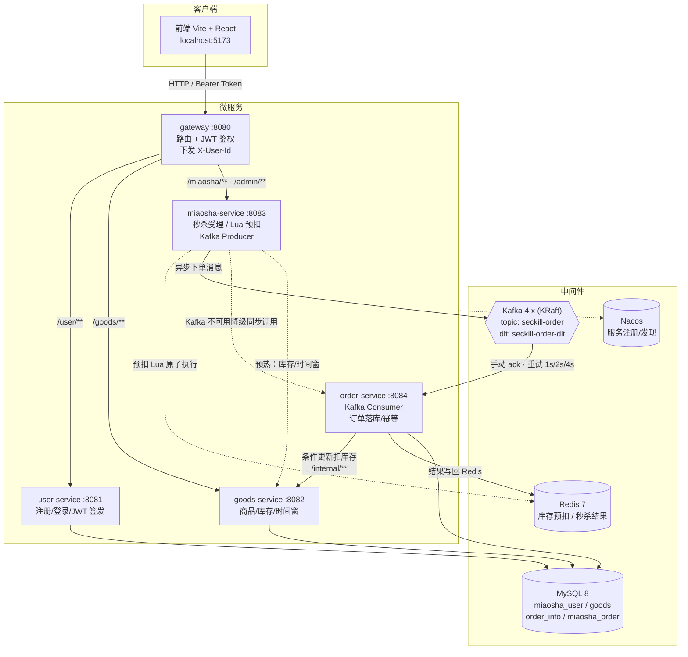
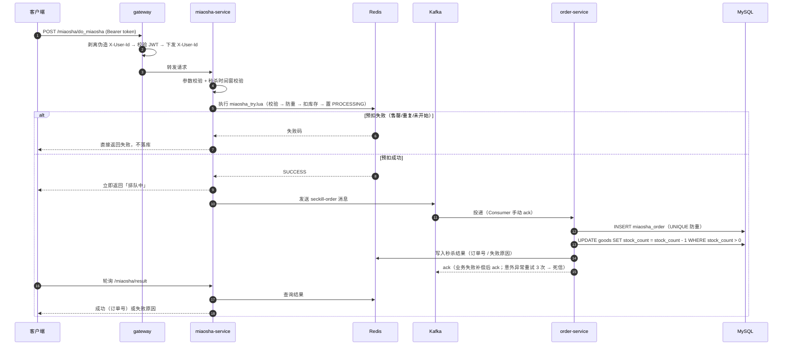
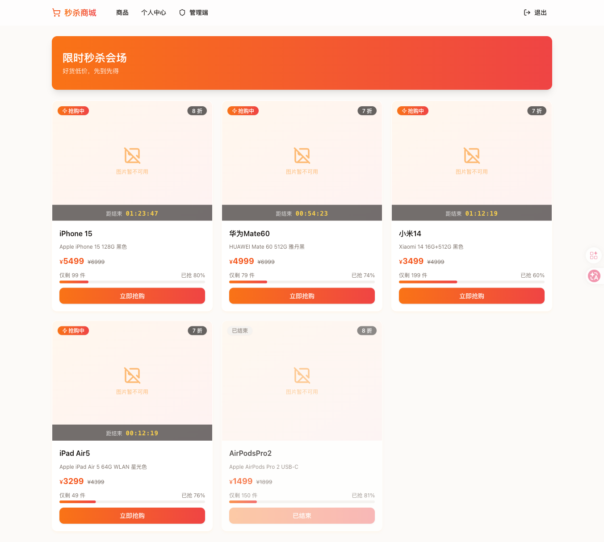
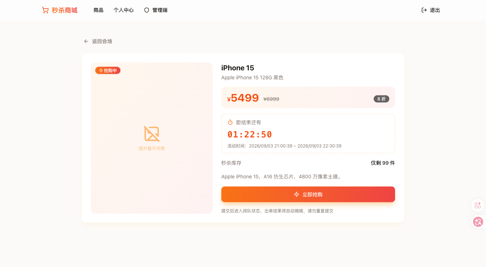
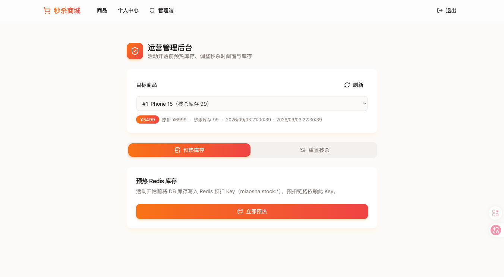

# Miaosha2 — 秒杀系统微服务化项目

基于 Spring Cloud 的秒杀系统，由单体架构（`backend/`）逐步改造为微服务架构。

## 技术栈

- Java 17 / Spring Boot 3.3.4 / Spring Cloud（Nacos 服务发现 + LoadBalancer）
- MySQL 8 / Redis 7 / Kafka 4.x（KRaft）
- Gateway：Spring Cloud Gateway（WebFlux）

## 核心链路

```
登录 → 商品 → 提交秒杀 → Redis 预扣 → Kafka 异步落库 → 轮询拿单
```

## 架构图

### 整体架构



### 秒杀核心链路



## 界面截图

| 秒杀会场（商品列表） | 商品详情 | 管理端（预热/重置） |
|---|---|---|
|  |  |  |

## 服务划分

| 服务 | 端口 | 职责 |
|---|---|---|
| gateway | 8080 | 统一入口：路由 + JWT 校验（`X-User-Id` 下发）+ `lb://` 服务名负载均衡 |
| user-service | 8081 | 用户/登录/注册，签发 JWT（表 `miaosha_user`） |
| goods-service | 8082 | 商品/库存/秒杀时间窗（表 `goods`） |
| miaosha-service | 8083 | 秒杀受理、Redis Lua 预扣、Kafka Producer |
| order-service | 8084 | Kafka Consumer、订单落库/幂等（表 `order_info`、`miaosha_order`） |
| common | — | 共享 DTO/Result/JwtUtil 等公共组件 |

## 关键设计

- **防超卖**：库存条件更新 `UPDATE goods SET stock_count = stock_count - 1 WHERE goods_id = ? AND stock_count > 0`
- **防重复**：`miaosha_order` 的 `UNIQUE(user_id, goods_id)` + 直接 INSERT 捕获冲突
- **Redis 预扣**：Lua 脚本原子执行（检查 → 防重 → 扣库存 → 置 PROCESSING）
- **Kafka**：topic `seckill-order`（死信 `seckill-order-dlt`），Consumer 手动 ack，业务失败补偿后 ack，意外异常重试 3 次（1s/2s/4s）后进死信
- **服务发现**：Nacos 注册与发现，路由与跨服务调用统一走服务名负载均衡

## 快速开始

### 1. 环境要求

- JDK 17
- Docker & Docker Compose

### 2. 启动中间件

```bash
docker compose up -d mysql redis kafka nacos
```

### 3. 初始化数据库

无需手动执行：MySQL 首次启动时会自动执行 `db/init/01-init.sql`（建库 + 建表 + 种子数据），秒杀时间窗由 `NOW()` 动态生成，任何时刻初始化都在窗口内。

> 注意：`/docker-entrypoint-initdb.d` 仅在 `./db/mysql_data` 数据目录为空时执行一次。修改 `01-init.sql` 后需重新初始化：
>
> ```bash
> docker compose down -v
> rm -rf ./db/mysql_data
> docker compose up -d
> ```

内置测试账号：手机号 `13800000001` ~ `13800000005`，密码均为 `123456`。

### 4. 构建与启动微服务

```bash
export JAVA_HOME=$(/usr/libexec/java_home -v 17)

mvn clean package -DskipTests
mvn -pl gateway -am spring-boot:run      # 8080 唯一公网入口
mvn -pl user-service -am spring-boot:run # 8081
mvn -pl goods-service -am spring-boot:run
mvn -pl miaosha-service -am spring-boot:run
mvn -pl order-service -am spring-boot:run
```

### 5. 访问

所有外部请求经 gateway（`http://localhost:8080`），路由：

- `/user/**` → user-service（登录 `/user/login`、注册 `/user/register` 免鉴权）
- `/goods/**` → goods-service
- `/miaosha/**`、`/admin/**` → miaosha-service

## 测试

各服务有独立 Testcontainers 集成测试（需先启动 Docker）：

```bash
mvn -pl <module> test                        # 某模块全部测试
mvn -pl <module> test -Dtest=ClassX#methodY  # 单个测试方法
```

## 配置覆盖

中间件连接均支持环境变量覆盖：`MYSQL_HOST/PORT`、`REDIS_HOST/PORT`、`KAFKA_BOOTSTRAP_SERVERS`、`NACOS_SERVER_ADDR`、`GOODS_BASE_URL`、`ORDER_SYNC_BASE_URL`。

> JVM 必须运行在 `Asia/Shanghai` 时区，否则时间窗校验 `checkInWindow` 会误判。

## 目录结构

```
├── gateway/          # 网关服务 (8080)
├── user-service/     # 用户服务 (8081)
├── goods-service/    # 商品服务 (8082)
├── miaosha-service/  # 秒杀服务 (8083)
├── order-service/    # 订单服务 (8084)
├── common/           # 公共组件
├── db/
│   └── init/         # MySQL 初始化脚本（01-init.sql，docker compose 首次启动自动执行）
├── docs/
│   └── screenshots/  # README 界面截图
├── frontend/         # 前端（Vite + React）
└── docker-compose.yaml
```
